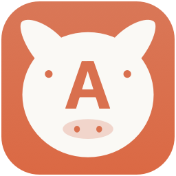

# A畜伴侣 · AChu Companion

**用中文输入，以多种语言与 Claude 交流。**

[English](README.en.md) · [使用帮助](SUPPORT.md) · [版本更新](CHANGELOG.md) · [贡献](CONTRIBUTING.md) · [隐私](docs/PRIVACY.md)

[](https://github.com/fisher-admin/a-chu-companion/actions/workflows/ci.yml)
[](LICENSE)



A畜伴侣是一款原生 macOS 菜单栏应用，把中文输入、外语回填、Claude 回复的中文翻译和账户额度放在一个窗口中。英文、德文、日文、韩文可选其一，中文始终是主要输入与阅读语言。

这是独立的社区项目，与 Anthropic 没有隶属关系，也不是 Claude 官方产品。它减少复制、粘贴和切换工具的操作，不保证翻译后的指令一定比中文原文更准确。

## 主要功能

- **双向翻译**：中文译为所选语言，Claude 的完整外语回复译回中文。默认使用 macOS 系统翻译，无需 API 密钥；已安装语言包复用。
- **Gemini 翻译**：可独立选择 Google 官方接口，默认固定为 Gemini 3.1 Flash-Lite；中文发送与回复回译共用配置，支持双向连接测试，密钥单独保存在钥匙串。
- **同页聊天**：回车提交，Shift＋回车换行；中文输入法选字的回车不提交。可仅翻译、回填后检查，或按设置自动发送。
- **持续读取**：连接即开始，伴侣或 Claude 原窗口产生的回复都可获取。先显示原文，再更新中文；识别正式回复，排除工具和运行状态。
- **后台运行**：切换到其他程序时继续读取。关闭伴侣窗口仅隐藏；停止读取或退出程序结束监测。保持 Claude 的已连接会话窗口打开。
- **跟随会话与历史选择**：同窗切换会话时自动跟随读取；发送到新会话前需重新连接输入框。滚动到历史回复后，可从当前可见完整回复中选择翻译。
- **长文阅读**：译文从开头显示，侧边滚动条浏览全文，外语原文可展开；中文字号 12／14／16，默认 14，语言和字号偏好保存。
- **临时记录**：仅本次运行保留最近 10 条已完成回复译文，退出清空；清除记录保留草稿，不删除 Claude 会话或停止监测。
- **账户额度**：连接聊天后自动跟随桌面、网页或 CLI 对应来源，显示已提供的五小时/每周进度、百分比与重置时间。设置用于首次入口配置及补充获取；缺失数据不会被当成0%，CLI重复报告不代表服务器刷新。
- **表格翻译**：普通表格保留行列与数值，中文表格可横向滚动并复制为 Markdown。Gemini 使用有限的附近文字判断表头词义，仍只负责翻译；复杂合并表格尚未验收。
- **Code 分段回复**：正式正文连续稳定约三秒后即开始翻译，无需等待下一次工具运行或整轮结束；续写稳定后更新对应分段，不显示工具进度和输出。每个分段单独计入最近十条译文。
- **原生外观**：猪头中央 A 的菜单栏图标，随系统明暗外观变化的磨砂玻璃界面及紧凑布局。

## 当前开发版优化

- 正式原文立即呈现，稳定片段自动逐块翻译；第一阶段中文不等整轮任务结束。修订保留已译前缀，同条更新保持阅读位置和选区。
- 兼容服务密钥按接口来源隔离，新增 OpenAI/Grok 地址预设并记住各来源模型；Gemini 原生配置保持。
- 增加折叠状态检查，自动检查不发送推理请求；额度刷新合并、冷却并遵守服务等待时间。
- 新增可见 Usage / CLI statusLine 及只读 CLI / Chrome 桥接。已配置入口选择聊天来源后自动跟随额度，无需另确认额度账户；没有有效当前身份时隐藏旧值，不回退其他端凭据。网页与CLI完整真实服务流程仍待验收。

当前开发版 **1.1.8 build71** 兼容CLI推荐提示：在当前输入窗口按Control＋Option＋E，无需清空推荐文字或选择会话。连接和粘贴不再因显示内容非空而拒绝，仍在自动回车前核对完整译文。54项CLI输入、30项路由及22项翻译状态通过，原生模拟验证推荐文字下实际粘贴和回车各1次。真实终端输入与回译待最终确认，见[本次修订](docs/testing/cli-prompt-suggestions-2026-10-08.md)。build70的全量34组结果及用户报告的推荐文字连接失败、build69实际填入失败、[旧自动输入记录](docs/testing/cli-automatic-input-2026-10-07.md)、build68复制流程、build66语言和长文实测、[build58实测](docs/testing/three-channel-active-usage-2026-10-07.md)及[Claude build63独立审查](docs/testing/claude-change-review-2026-10-07.md)完整保留；全部桌面、网页和CLI真实验收尚未完成.

## 系统与适配范围

| 项目 | 当前范围 |
| --- | --- |
| 平台 | Apple Silicon Mac；当前脚本构建 arm64 |
| 系统 | 最低部署目标 macOS 15；主要在 macOS 26 验证 |
| 聊天 | Claude 桌面版（Chat 与 Code 模式）及 Chrome 中的 claude.ai |
| 翻译 | macOS 系统翻译；Google Gemini；自定义 OpenAI 兼容 AI 翻译服务 |
| 权限 | 回填和读取需要 macOS 辅助功能权限；桌面额度读取可能需要钥匙串授权 |
| 中文输入 | 最多 10,000 字符，包含标点与换行 |
| 外语内容 | 发出的译文及读取的原文各最多 50,000 字符，统一按字符计算 |

其他浏览器、Intel Mac 及 macOS 15 的实际使用尚未经过同等验证。Claude 界面变化、未提供给辅助功能的历史正文和暂停的浏览器页面可能影响读取。Claude 自身的消息大小、上下文和账户限制仍适用。

## 从源码安装

准备 Swift 编译环境（较新的 Xcode／Command Line Tools，需包含 macOS 26 SDK）和 Python 3。下载本仓库后，在项目目录执行：

```bash
git clone https://github.com/fisher-admin/a-chu-companion.git
cd a-chu-companion
./setup-signing.sh
./install.sh
open "$HOME/Applications/A畜伴侣.app"
```

首次设置会在你的 macOS 登录钥匙串中创建或复用本机专用签名。每台 Mac 使用自己的身份；不需要维护者的证书或登录信息。安装位置为 `~/Applications/A畜伴侣.app`。

当前发布以源码为主，没有 Apple Developer ID 公证的通用安装包。本机签名用于更新身份连续性，不代表 Apple 公证。CI 的验证包不作为正式安装包发布。

1. 在「系统设置 → 隐私与安全性 → 辅助功能」允许 A畜伴侣。
2. 点击 Claude 的消息输入框，用实体键盘按 **Control＋Option＋E** 连接。
3. 选择英文、德文、日文或韩文，在伴侣中输入中文，回车提交。
4. 默认仅填入译文，由你确认后发送；需要自动发送时开启「填入后发送」，选择回车或 Command＋回车。
5. 连接后自动读取完整回复。可随时停止、恢复，或点击「读取历史回复」。

Claude Code终端请在已登录CLI正在使用的输入窗口用实体键盘按 **Control＋Option＋E**，直接连接该窗口，无需清空推荐文字或选择CLI会话。伴侣保存当前输入位置，获取回复及额度来源，并核对底部会话编号与「输入」标记；标记或报告稍晚出现时继续核对同一窗口，不按终端品牌或报告时间猜测目标。主界面「连接 CLI」仅用于补充准备入口和刷新报告，不能代替输入窗口里的快捷键。无法唯一核对时显示具体连接原因，发送按钮保持禁用。

绑定成功后，在伴侣输入中文并回车，译文自动粘贴到原CLI输入区。开启「填入后发送」时，仅在短单行译文完整接收并再次核对目标后自动回车；多行及表格保留内容但需在终端确认发送。长粘贴折叠、暂时无法核对全文、原焦点/进程变化时不自动回车、不重复粘贴，译文保留供复制。旧入口或无法提供输入表面的终端保持只读。历史发送消息也可复制外文，同一会话切目录不生成额外连接。正文读取须核实MessageDisplay支持；真实终端及不同载体的完整往返另行验收，见[快捷键直连记录](docs/testing/cli-shortcut-binding-2026-10-08.md)。

正常授权后提示会自动更新，无需重启。沿用相同本机签名的正常升级可保留授权；换电脑、更改身份或撤销权限后可能需重新授权。

## 配置 Gemini

打开右上角「翻译设置」，选择「Gemini」，保留模型 `gemini-3.1-flash-lite`，勾选更新密钥并在密码框中填入 Google AI Studio 的 API key。点击「测试连接」核对中译英及英译中，再保存。测试只发送两句固定文字，不读取当前聊天，也不保存尚未提交的密钥；保存后重启、正常升级会保留翻译方式、模型和钥匙串密钥。

Gemini 直接调用 Google 的 `generateContent` 接口，不需要 OpenAI 兼容地址。`gemini-flash-latest` 是会变化的 Flash 别名，不保证选中 Flash-Lite。该模型有有限免费层，实际限额以项目为准；启用结算的项目可能收费，免费层内容可能用于改进 Google 产品。详见 [Gemini 配置与正确调用示例](docs/GEMINI_SETUP.md)。

## 更新与历史

```bash
git pull --ff-only
./install.sh
```

安装前检查原签名身份；构建失败或身份不一致时不替换已有正式应用。语言、字号和已安装语言包保留，运行期间聊天记录在退出时清空。

[CHANGELOG](CHANGELOG.md) 记录版本变化，[完整旧 README](docs/DEVELOPMENT_HISTORY.zh-CN.md) 保留早期开发记录，[TEST_PLAN](TEST_PLAN.md) 保留各版实际验收结果。Git 提交历史完整保留；发布标签对应实际源码提交。

## 数据与隐私

默认使用系统翻译，不需要翻译 API 密钥；首次语言包下载可能联网。选择 Gemini 会将中文草稿及外语回复直接发送至 Google；选择 AI 翻译会发送至你指定的兼容服务。费用和数据规则由对应服务决定。

聊天记录不写入磁盘；指定 session、翻译密钥保存在 macOS 钥匙串。额度使用只读请求，只向 Claude 官方域名发送对应会话凭据，不发送聊天消息；桌面与网页账户不同时需要连接正确的额度账户。

发送前核对原输入框；无法验证回填时不自动发送。超限、失败或取消保留内容并提示，长文完整翻译后合并，不发送半截译文。系统翻译可能改变代码中的标点，执行代码应核对外语原文。

完整说明见 [隐私与权限](docs/PRIVACY.md)，漏洞请通过 [私密安全报告](https://github.com/fisher-admin/a-chu-companion/security/advisories/new) 提交，不公开凭据或私人聊天。

## 开发与验证

```bash
python3 -m unittest discover -s Tests -p RepositoryChecksTests.py
python3 Tools/check_repository.py --history
./test.sh
./test-http.sh
./build.sh --unsigned
```

`--unsigned` 仅输出到 `dist/unsigned/`，不读取本机签名配置，不安装、不覆盖正式签名包。默认 `./build.sh` 与 `./install.sh` 仍要求固定本机签名。

GitHub CI 执行仓库检查、离线回归、本机模拟 HTTP 和无证书构建；CodeQL 分析 Swift、Python 和 Actions 配置。自动运行不登录 Claude、不发送真实消息、不安装语言包。本机语言、签名及实际 Claude 检查单独进行，详见 [贡献说明](CONTRIBUTING.md) 和 [验收记录](TEST_PLAN.md)。

build70全量离线回归为34组，CLI输入检查49项，连接路由30项；本次Python检查23项。build69本机HTTP19项等旧结果保留，不改写为build70新测试。历次原生验证涵盖连续回复、长等待、后台读取、历史选择、停止与恢复、偏好记忆及接近五万字符回复；各项对应版本分别留档。实际Google调用、Code模式及实验性CLI入口验收单独记录；未完成的网页、终端和系统组合不作为已通过宣传。

build41 修订句内文件、链接和强调文字的多余断行，并在所有翻译方式的共同流程中处理翻译服务新增的换行，保留真实段落、代码、列表及表格结构。段落模拟与窗口显示检查见[排版记录](docs/testing/paragraph-layout-2026-10-06.md)。之前 Code 补测证明阶段中文提前出现，但也记录了未译阶段、表格语义问题及测试预算超限，不能据此宣称完整真实验收通过；详见[2026-10-06 补测报告](docs/testing/real-code-supplement-results-2026-10-06.md)。

## 社区与许可

欢迎 [问题报告](https://github.com/fisher-admin/a-chu-companion/issues/new/choose)、功能建议和 Pull Request。先阅读 [CONTRIBUTING](CONTRIBUTING.md)、[行为准则](CODE_OF_CONDUCT.md) 和 [SUPPORT](SUPPORT.md)。

本项目采用 [MIT License](LICENSE)。Anthropic、Claude、Apple 等名称属于各自权利人；本项目许可不授予第三方商标权。
